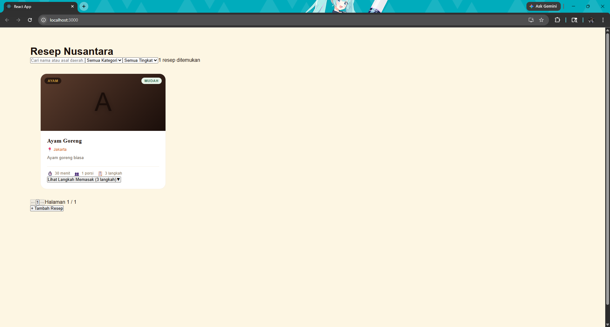
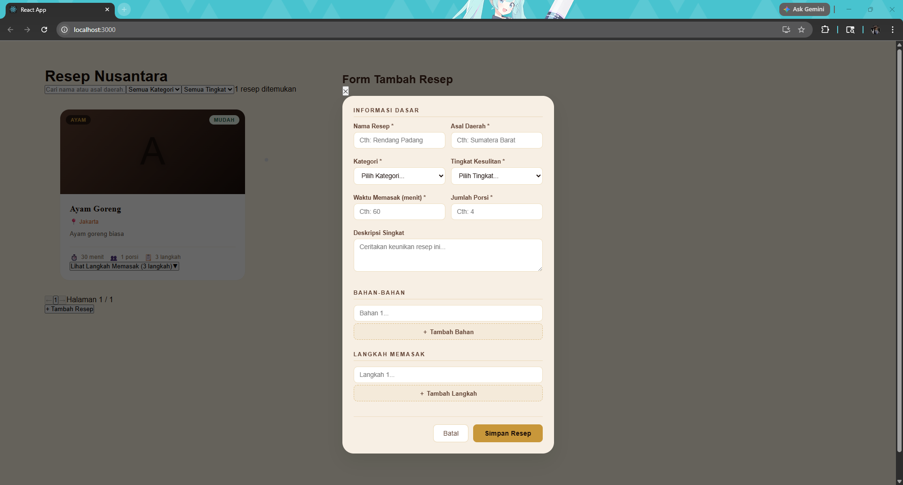
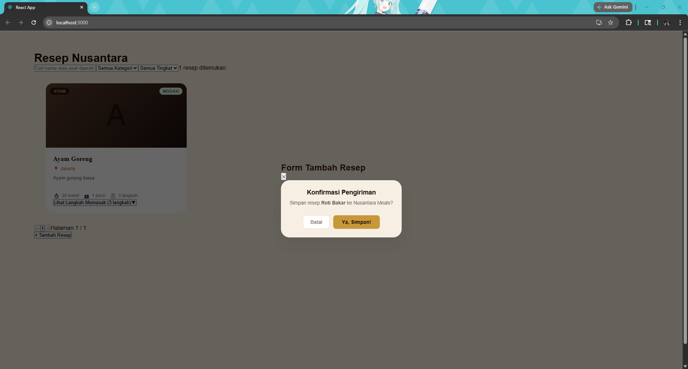
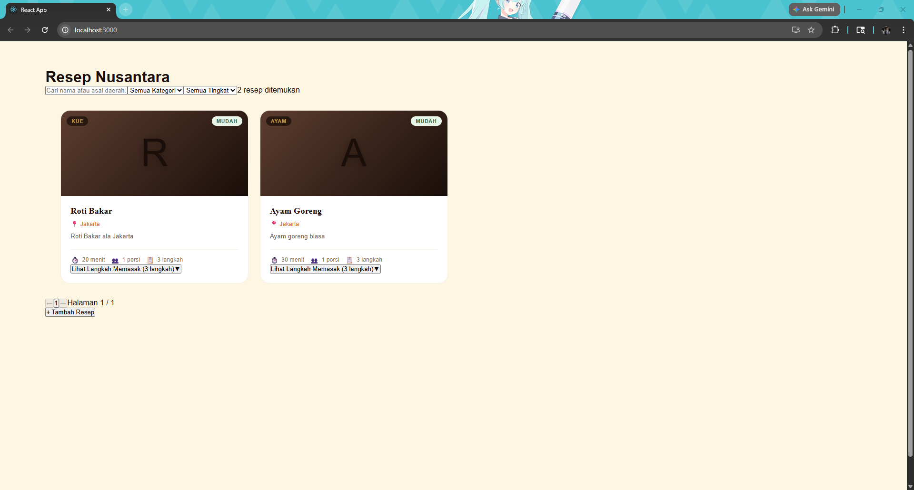
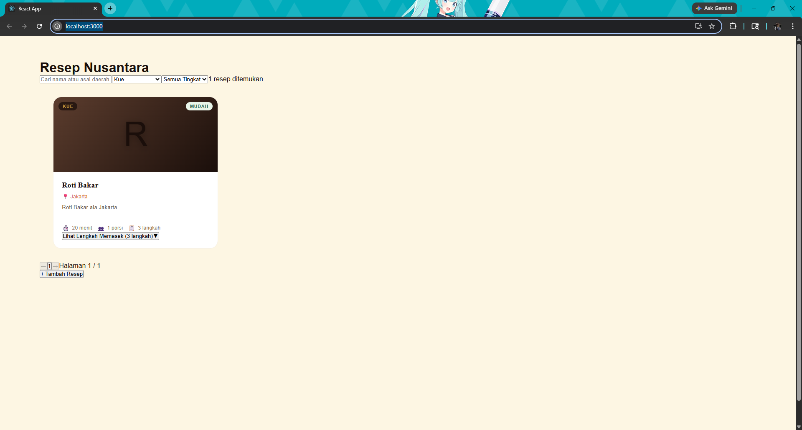
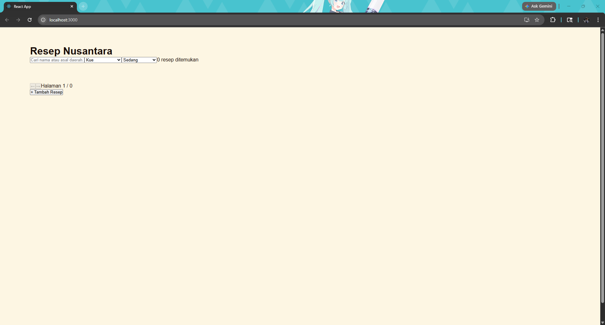

# UTS Pemrograman Web Lanjut
## Informasi
Resep Nusantara adalah aplikasi web untuk mengelola dan menampilkan resep masakan tradisional Indonesia. Aplikasi ini dirancang untuk mendukung program digitalisasi UMKM dalam rangka Gerakan Nasional Bangga Buatan Indonesia

Nama: Fathan Andhika Daffa Putra Adhiwibowo  
NIM: 2410501056  
Kelas: B  

## Screenshot
Tampilan homepage

Tampilan penambahan resep

Tampilan konfirmasi

Tampilan homepage setelah ditambah

Tampilan filter nama

Tampilan filter tingkat

## Cara Menjalankan
### Langkah 1 - Jalankan XAMPP
1.	Buka aplikasi XAMPP Control Panel
2.	Klik tombol Start di sebelah Apache
3.	Klik tombol Start di sebelah MySQL
4.	Pastikan kedua baris berwarna hijau

### Langkah 2 - Buat Database
5. CREATE DATABASE resep_nusantara;
6. USE resep_nusantara;
7. CREATE TABLE resep (  
    id          INT AUTO_INCREMENT PRIMARY KEY,  
    nama        VARCHAR(255) NOT NULL,  
    asal_daerah VARCHAR(255) NOT NULL,  
    kategori    ENUM('Daging','Seafood','Ayam','Sayuran','Nasi','Sup','Kue','Minuman') NOT NULL,  
    kesulitan   ENUM('Mudah','Sedang','Sulit') NOT NULL,  
    waktu       INT NOT NULL COMMENT 'Dalam menit',  
    porsi       INT NOT NULL,  
    deskripsi   TEXT,  
    bahan       JSON NOT NULL COMMENT 'Array string bahan-bahan',  
    langkah     JSON NOT NULL COMMENT 'Array string langkah memasak',  
    created_at  TIMESTAMP DEFAULT CURRENT_TIMESTAMP,  
    updated_at  TIMESTAMP DEFAULT CURRENT_TIMESTAMP ON UPDATE CURRENT_TIMESTAMP  
);

### Langkah 3 - Jalankan Backend (jika ada node_modules)
8.	Buka Command Prompt atau Terminal
9.	Masuk ke folder backend: cd C:\path\ke\resep-nusantara\backend
10.	Jalankan server: npm run dev
11.	Tunggu hingga muncul tulisan: Database terhubung!

### Langkah 3 - Setup & Jalankan Backend (Jika tidak ada node_modules)
8.  Buka Command Prompt atau Terminal
9.  Masuk ke folder backend: `cd backend`
10. Install dependensi: `npm install`
11. Pastikan file `.env` sudah ada dan sesuai dengan database XAMPP kamu.
12. Jalankan server: `npm run dev`

### Langkah 4 - Jalankan Frontend (jika ada node_modules)
12.	Buka Terminal baru (jangan tutup terminal backend)
13.	Masuk ke folder frontend: cd C:\path\ke\resep-nusantara\frontend
14.	Jalankan React app: npm start
15.	Browser akan terbuka otomatis di http://localhost:3000

### Langkah 4 - Setup & Jalankan Frontend (Jika tidak ada node_modules)
13. Buka Terminal baru
14. Masuk ke folder frontend: `cd frontend`
15. Install dependensi: `npm install`
16. Jalankan React app: `npm start`